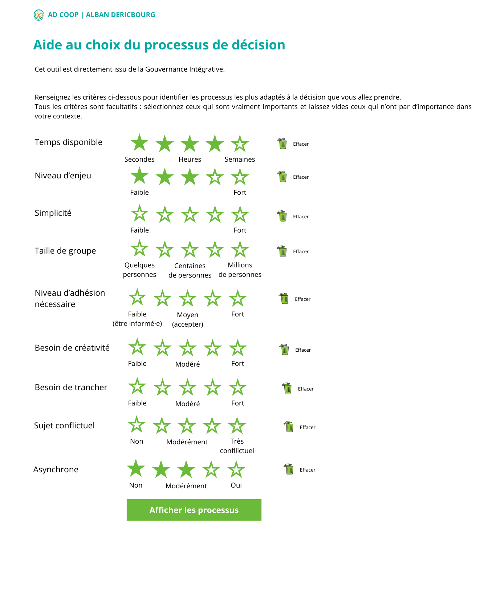
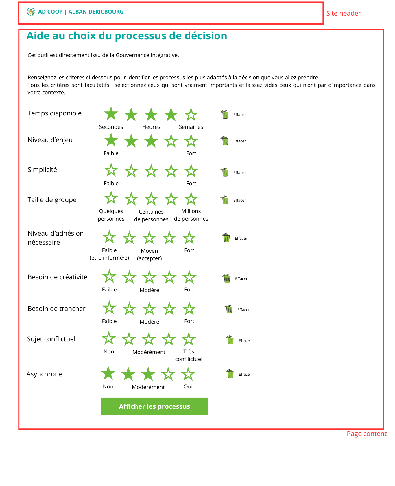

# Select relevant criteria to choose a process

## Goal

Create the form that will select the relevant criteria to choose a decision process.

## Content

### Header (global layout)

- Logo: `logo-ecrans-RVB-carre.png`
- Text: "AD COOP | ALBAN DERICBOURG"

### Page

**Title:** Aide au choix d'un processus de décision

**Intro text:**

> Cet outil est directement issu de la [Gouvernance Intégrative](https://gouvernanceintegrative.com/).
>
> Renseignez les critères ci-dessous pour identifier les processus les plus adaptés à la décision que vous allez prendre.
> Tous les critères sont facultatifs : sélectionnez ceux qui sont vraiment importants et laissez vides ceux qui n'ont pas d'importance dans votre contexte.

**Submit button:** Identifier les processus adaptés

### Criteria

| Criterion                    | Label 1               | Label 2 | Label 3                | Label 4 | Label 5               |
| ---------------------------- | --------------------- | ------- | ---------------------- | ------- | --------------------- |
| Temps disponible             | Secondes              |         | Heures                 |         | Semaines              |
| Niveau d'enjeu               | Faible                |         |                        |         | Fort                  |
| Simplicité                   | Faible                |         |                        |         | Fort                  |
| Taille de groupe             | Quelques personnes    |         | Centaines de personnes |         | Milliers de personnes |
| Niveau d'adhésion nécessaire | Faible (être informé) |         | Moyen (accepter)       |         | Fort                  |
| Besoin de créativité         | Faible                |         | Modéré                 |         | Fort                  |
| Besoin de trancher           | Faible                |         | Modéré                 |         | Fort                  |
| Sujet conflictuel            | Non                   |         | Modérément conflictuel |         | Très conflictuel      |
| Asynchrone                   | Non                   |         | Modérément             |         | Oui                   |

## Mockups





## Acceptance Criteria

### Layout

- [ ] Global layout with reusable `Header` component (logo + site title)
- [ ] Page title and intro text as specified
- [ ] Criteria list with star ratings
- [ ] Submit button at bottom (disabled state not required)
- [ ] All star components have the same width (stars are vertically aligned one to another)

### Star Rating Component

- [ ] Generic `StarRating` component reusable for each criterion
- [ ] Accepts `label` prop for criterion name
- [ ] Accepts `starLabels` prop (array of 5 strings, can be empty)
- [ ] Uses SVG for star icons
- [ ] Empty star: border only (color: #CCCCCC or similar neutral)
- [ ] Filled star: solid fill (#00a9a2)
- [ ] Half-star support: click on left half = X.5, right half = X+1
- [ ] Hover preview: shows fill that would result from click
- [ ] On mouse leave without click: preview disappears
- [ ] On click: value is committed and persists

### Reset Button

- [ ] Trash icon on right of each criterion row
- [ ] Clicking resets that criterion to no value (null/undefined)
- [ ] Stars return to empty state

### Mobile Layout (< 768px)

- [ ] Criterion label stacked above stars
- [ ] Star labels below stars (smaller font or hidden if too cramped)
- [ ] Full-width submit button
- [ ] Adequate touch targets (min 44px)

### Accessibility

- [ ] Star rating keyboard navigable (Tab to focus, Arrow keys to change value)
- [ ] `aria-label` on star rating: "{criterion}: {value} sur 5" (or "non renseigné" if empty)
- [ ] Trash button: `aria-label="Effacer {criterion}"`
- [ ] Focus visible on all interactive elements
- [ ] External link opens in new tab with `target="_blank"` and `rel="noopener noreferrer"`
- [ ] External link includes accessible indicator (e.g., "(nouvelle fenêtre)" in text or `aria-label`)

### Behaviour

- [ ] At least one criterion must be selected to submit
- [ ] When no criterion is selected, display inline error above button: "Sélectionnez au moins un critère"
- [ ] Error uses `aria-live="polite"` for screen reader announcement
- [ ] Error disappears when user selects at least one criterion
- [ ] Submit button does nothing for this iteration (validation only)

## Tech Design

### Components to Create

```
src/components/
├── common/
│   └── StarRating/
│       ├── StarRating.tsx      # Main component
│       ├── StarRating.test.tsx # Unit tests
│       └── StarIcon.tsx        # SVG star (full, half, empty)
└── ui/
    └── Layout/
        ├── Layout.tsx          # Global layout wrapper
        └── Header.tsx          # Site header with logo
```

### State Management

- Use React `useState` for form state (no Zustand yet)
- State shape: `Record<string, number | null>` where key is criterion ID

## Colors

- Primary: #00a9a2 (filled stars, button)
- Empty star border: #CCCCCC
- Text: inherit from global styles

## Out of Scope

- Process results display (future spec)
- Backend API integration
- Persisting state (localStorage, etc.)

## Resources

- Logo: [logo-ecrans-RVB-carre.png](logo-ecrans-RVB-carre.png)
