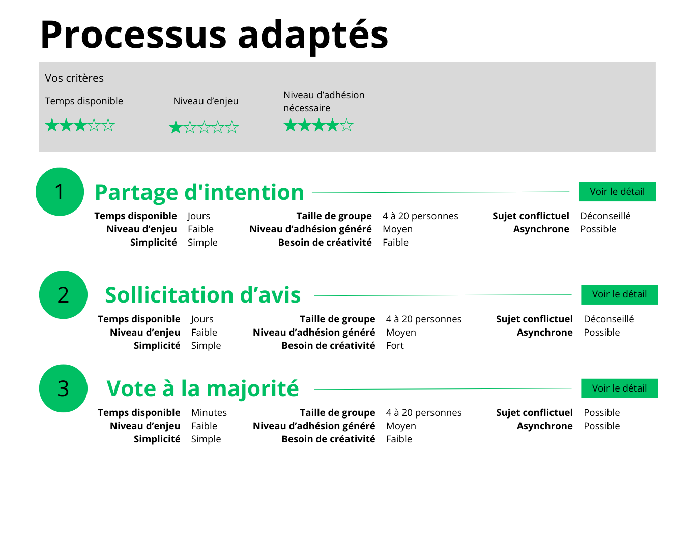

# Show filtering results

## Goal

Based on the selected criteria on the home page, show the most adapted decision processes.

## Prerequisites

1. Build a table where each decision process described in [processus-decision.md](processus-decision.md) has an evaluation of their search criterion value.
2. Remove the "Besoin de trancher" criterion from the search form (this criterion is not present in the catalog).

## Rules

- Display 3 processes by default. In case of ex-aequo, display up to 5.
- Show selected criteria in a banner on top of the results.
- For now, the button "Voir le détail" does nothing.
- Available processes are listed in [this file](processus-decision.md).

## Process matching

### Overview

All criteria use values on a 0-5 scale. The algorithm scores each process based on how well it matches the user's selected criteria.

### Scoring method

For each criterion the user has selected:

**Single value:**

```
score = 5 - |user_value - process_value|
```

**Range value (e.g., group size "8 to millions"):**

```
if user_value within [min, max]:
    score = 5  (perfect match)
else:
    distance = min(|user_value - min|, |user_value - max|)
    score = 5 - distance
```

**Wildcard value (`*`):**

```
score = 5  (always a perfect match)
```

The wildcard indicates the process adapts to any value of that criterion.

### Unselected criteria

Unselected criteria are ignored. Only score based on criteria the user actually rated.

### Final ranking

```
total_score = sum of scores for all selected criteria
rank processes by total_score (descending)
```

### Ex-aequo handling

- Display up to 3 processes by default
- If processes at position 3, 4, 5 have the same score as the process at position 3, show up to 5

### Weighting

All criteria have equal weight (no weighting applied).

## Text-to-numeric mappings

Each criterion needs a mapping from catalog text values to the 0-5 scale.

### Criteria ID mapping

The form uses specific IDs that map to the spec's column names:

| Form ID           | Spec Column | Description            |
| ----------------- | ----------- | ---------------------- |
| temps-disponible  | Temps       | Available time         |
| niveau-enjeu      | Enjeu       | Stakes level           |
| simplicite        | Simplicité  | Simplicity required    |
| taille-groupe     | Taille      | Group size             |
| niveau-adhesion   | Adhésion    | Consensus level needed |
| besoin-creativite | Créativité  | Creativity need        |
| sujet-conflictuel | Conflictuel | Conflictual topic      |
| asynchrone        | Asynchrone  | Async capability       |

### Temps disponible

| Text     | Value |
| -------- | ----- |
| Secondes | 1     |
| Minutes  | 2     |
| Heures   | 3     |
| Jours    | 4     |
| Semaines | 5     |

### Niveau d'enjeu

| Text      | Value |
| --------- | ----- |
| Faible    | 1.5   |
| Moyen     | 3     |
| Fort      | 4     |
| Très fort | 5     |

### Simplicité

| Text     | Value |
| -------- | ----- |
| Simple   | 1.5   |
| Moyen    | 3     |
| Complexe | 4.5   |

### Taille de groupe

Maps the star scale (1-5) to approximate group sizes:

| Stars | Meaning         |
| ----- | --------------- |
| 1     | ~4 people       |
| 2     | ~8 people       |
| 3     | ~20 people      |
| 4     | ~50 people      |
| 5     | 50+ / thousands |

### Niveau d'adhésion

| Text   | Value |
| ------ | ----- |
| Faible | 1.5   |
| Moyen  | 3     |
| Fort   | 4.5   |

### Besoin de créativité

| Text   | Value |
| ------ | ----- |
| Aucun  | 1     |
| Faible | 2     |
| Moyen  | 3     |
| Fort   | 4.5   |

### Sujet conflictuel

| Text                    | Value |
| ----------------------- | ----- |
| Non adapté              | 1     |
| Déconseillé             | 2     |
| Variable / Attention    | 3     |
| Possible / Risqué       | 3.5   |
| Peut aider à départager | 4     |
| Adapté                  | 5     |

### Asynchrone

| Text                    | Value |
| ----------------------- | ----- |
| Non (nécessite réunion) | 1     |
| Difficile               | 2     |
| Possible                | 3.5   |
| Oui (facile)            | 5     |

## Decision process summary

This table lists all decision processes with their numeric criterion values. Ranges are noted as `min-max`.

### Families of processes

| Process                             | Temps | Enjeu | Simplicité | Taille | Adhésion | Créativité | Conflictuel | Asynchrone |
| ----------------------------------- | ----- | ----- | ---------- | ------ | -------- | ---------- | ----------- | ---------- |
| Votes à choix multiples             | 3     | 3-4   | 3-4.5      | 1-5    | 3-4.5    | 4.5        | 5           | 1          |
| Processus consultatifs              | 3-4   | 1.5-3 | 1.5-3      | 1-5    | 1.5-3    | 4.5        | 2           | 3.5        |
| Processus horizontaux - égalitaires | 3-5   | 4-5   | 4.5        | 1-3    | 4.5      | 4.5        | 2           | 2          |
| Mode de décisions libertaires       | 1-2   | 1.5   | 1.5        | 1-5    | 1.5      | 4.5        | 1           | 5          |
| Suivre un signe                     | 2-3   | 1.5-3 | 3          | 1-2    | 3        | 2          | 3           | 3          |
| Hasard                              | 2     | 1.5   | 1.5        | 1-5    | 1.5      | 2          | 4           | 5          |
| Tradition, habitudes                | 1     | 1.5-4 | 1.5        | 1-5    | 1.5      | 1          | 1           | 5          |
| Non-choix                           | \*    | \*    | 1.5        | 1-5    | 1.5      | 1          | 3           | 5          |
| Déléguer la décision à un rôle      | 3     | 1.5-4 | 1.5-3      | 1-5    | 1.5-3    | 4.5        | 3           | 5          |

### Individual processes

| Process                  | Temps | Enjeu | Simplicité | Taille | Adhésion | Créativité | Conflictuel | Asynchrone |
| ------------------------ | ----- | ----- | ---------- | ------ | -------- | ---------- | ----------- | ---------- |
| Vote à la majorité       | 3     | 3-4   | 1.5        | 2-5    | 3        | 2          | 3.5         | 5          |
| Partage d'intention      | 4     | 1.5   | 1.5        | 1-3    | 3        | 2          | 2           | 5          |
| Sollicitation d'avis     | 4     | 3     | 3          | 1-5    | 3        | 4.5        | 2           | 5          |
| Consultation collective  | 3     | 3-4   | 3          | 1-3    | 3-4.5    | 4.5        | 3           | 1          |
| Consentement             | 3     | 4     | 4.5        | 1-3    | 4.5      | 4.5        | 2           | 2          |
| Consensus (formel)       | 3-5   | 4     | 4.5        | 1-3    | 4.5      | 4.5        | 2           | 2          |
| Consensus informel       | 3     | 4     | 3-4.5      | 1-3    | 4.5      | 4.5        | 2           | 2          |
| Décisions algorithmiques | 2-3   | 1.5-3 | 3          | 2-5    | 3        | 2          | 3.5         | 5          |
| Vote par approbation     | 3     | 3-4   | 3-4.5      | 2-5    | 4.5      | 4.5        | 5           | 1          |
| Règle de trois           | 3     | 3     | 1.5        | 2-5    | 3        | 4.5        | 2           | 5          |

**Legend:**

- `*` = Wildcard (matches any user value, always scores 5)
- Ranges (e.g., `3-4`) indicate the process supports a range of values

### Group size mapping reference

For the "Taille" column:
| Value | Group size |
|-------|------------|
| 1 | ~4 people |
| 2 | ~8 people |
| 3 | ~20 people |
| 4 | ~50 people |
| 5 | 50+ / thousands / millions |

## Mockups


