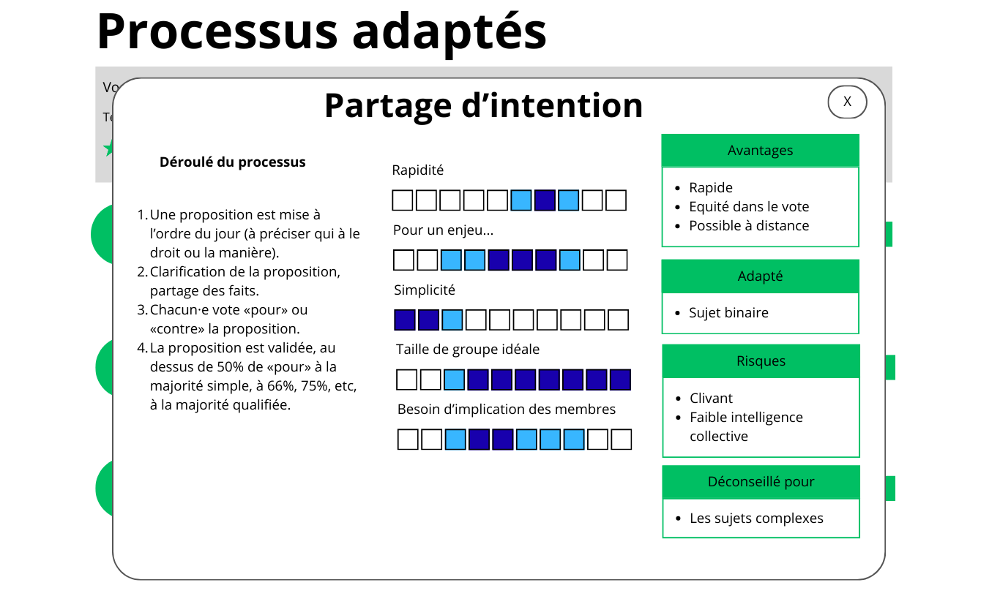

# Display process details

## Context

The process filtering results currently shows choice criteria about a process, but not the details of that process.
In particular: how to run it?

## Goal

Display the details of a given process in a modal dialog.

## Rules

### Modal behavior

- When clicking on the "Voir le détail" button, open a modal with the process details.
- The modal can be closed by:
  - Clicking the X button in the top-right corner
  - Clicking outside the modal (on the backdrop)
  - Pressing the Escape key
- Focus should be trapped inside the modal while open (accessibility requirement).

### Modal content

The modal displays three sections:

#### 1. Process steps ("Déroulé du processus")

- Shows the numbered steps to run the process.
- **Only displayed for individual processes** (not for process families).
- Data source: "Étapes du processus" from [processus-decision.md](../0003-choose-process/processus-decision.md).

#### 2. Criteria performance scales

- Display how the process performs for each criterion on a **10-square scale**.
- Use **custom display labels** (shorter than the search form labels):

| Search form label    | Modal display label              |
| -------------------- | -------------------------------- |
| Temps disponible     | Rapidité                         |
| Niveau d'enjeu       | Niveau d'enjeu                   |
| Simplicité           | Simplicité                       |
| Taille de groupe     | Taille de groupe idéale          |
| Niveau d'adhésion    | Niveau d'adhésion                |
| Besoin de créativité | Besoin de créativité             |
| Sujet conflictuel    | Sujet conflictuel                |
| Asynchrone           | Asynchrone                       |
| Besoin d'implication | Besoin d'implication des membres |

#### 3. Contextual usage blocks

Four blocks displaying:

- **Avantages**: Benefits of the process
- **Adapté**: Situations where the process is well-suited
- **Risques**: Potential risks or drawbacks
- **Déconseillé pour**: Situations where the process should be avoided

### 10-square scale specifications

#### Value mapping

Convert the 0-5 criterion values to the 1-10 scale by **doubling the values**:

- Value 1.5 → squares around 3
- Value 3 → squares around 6
- Value 4.5 → squares around 9

#### Color coding

Three states for each square:

1. **Dark blue** (primary): The optimal/main score for this criterion
2. **Light blue** (secondary): Extended range - the process can work but isn't optimal
3. **White/empty**: Not applicable for this process

For a **single value**: Color the corresponding square dark blue.

For a **range** (e.g., 3-4 → squares 6-8):

- Dark blue for the core range
- Light blue for extended values if the process can stretch beyond

#### Accessibility

Screen readers should announce scales using **qualitative descriptions** rather than numerical values.

Format: "[Criterion label]: [qualifier for ideal range]. [Extended range qualifier if applicable]."

**Qualifier mapping per criterion:**

| Scale (1-10) | Rapidité           | Niveau d'enjeu  | Simplicité           |
| ------------ | ------------------ | --------------- | -------------------- |
| 1-2          | Instantané         | Enjeu faible    | Très simple          |
| 3-4          | Quelques minutes   | Enjeu modéré    | Simple               |
| 5-6          | Quelques heures    | Enjeu important | Moyennement complexe |
| 7-8          | Quelques jours     | Enjeu fort      | Complexe             |
| 9-10         | Plusieurs semaines | Enjeu très fort | Très complexe        |

| Scale (1-10) | Taille de groupe idéale      | Niveau d'adhésion   | Besoin de créativité  |
| ------------ | ---------------------------- | ------------------- | --------------------- |
| 1-2          | Petit groupe (4 pers.)       | Adhésion faible     | Peu de créativité     |
| 3-4          | Groupe moyen (8 pers.)       | Adhésion modérée    | Créativité modérée    |
| 5-6          | Grand groupe (20 pers.)      | Bonne adhésion      | Créativité importante |
| 7-8          | Très grand groupe (50 pers.) | Forte adhésion      | Forte créativité      |
| 9-10         | Groupe massif (50+ pers.)    | Très forte adhésion | Très forte créativité |

| Scale (1-10) | Sujet conflictuel              | Asynchrone             | Besoin d'implication   |
| ------------ | ------------------------------ | ---------------------- | ---------------------- |
| 1-2          | Non adapté aux conflits        | Réunion nécessaire     | Implication minimale   |
| 3-4          | Déconseillé si conflit         | Difficile à distance   | Implication modérée    |
| 5-6          | Possible avec précaution       | Partiellement possible | Implication importante |
| 7-8          | Adapté en cas de tensions      | Facilement à distance  | Forte implication      |
| 9-10         | Idéal en situation de conflits | Totalement asynchrone  | Implication très forte |

**Example announcements:**

- Single value: "Rapidité: réalisable en quelques heures"
- Range: "Rapidité: idéal en quelques heures, acceptable en quelques jours"

### Responsive design

- **Desktop**: 3-column layout as shown in mockup
  - Left: Process steps
  - Center: Criteria scales
  - Right: Contextual usage blocks
- **Mobile**: Stack all sections vertically in order:
  1. Process steps (if applicable)
  2. Criteria scales
  3. Contextual usage blocks

### Data source

Import all data from [../0003-choose-process/processus-decision.md](../0003-choose-process/processus-decision.md).

### Footer

At the bottom of the modal, display the following footnote:

> Contenu tiré de la boîte à outils de la [Gouvernance Intégrative](https://gouvernanceintegrative.com/), distribuée en CC by SA

## Mockups

